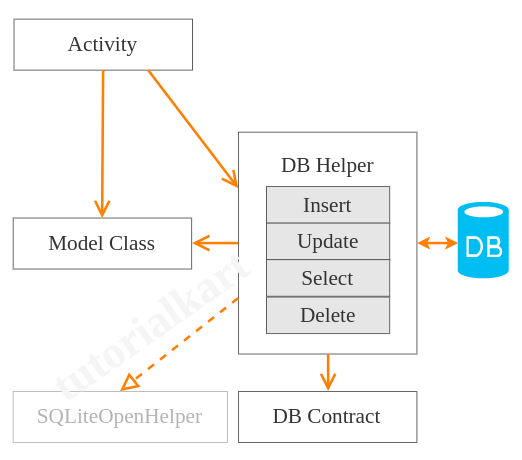

# sqlitetutorial
Kotlin Android SQLite – Example Application

**Kotlin Android SQLite Tutorial**
Kotlin Android SQLite – SQLite is an open source database based on SQL language. Android has SQLite database implementation by default.

In this tutorial, we will learn how to do basic SQLite operations like inserting a row into table, reading rows from table, updating rows in table and deleting rows.

We shall look into typical classes that we use for using SQLite database

Class              | Summary
------------------ | ----------------------------------------------------------
DB Contract Class  | Contains schema (table name and column names) for program understandability.
DB Helper Class    | This class contains methods that do database operations like insert, select, update, delete, etc.
Model Data Class   | Used to carry objects (rows of DB table)
Activity Class	   | This is class file of your Activity from which you call DB Helper’s methods for database activities.

**Sample Application Structure**

Following are the details of the Android Application we created for this example.

Property            | Details
--------------------|----------------------------------
Application Name    | SQLiteTutorial
Package name        | edu.tutorials.sqlitetutoria
Minimum SDK         | API 21: Android 5.0 (Lollipop)
Activity            | Empty Activity

(courtesy: https://www.tutorialkart.com/kotlin-android/android-sqlite-example-application/)

